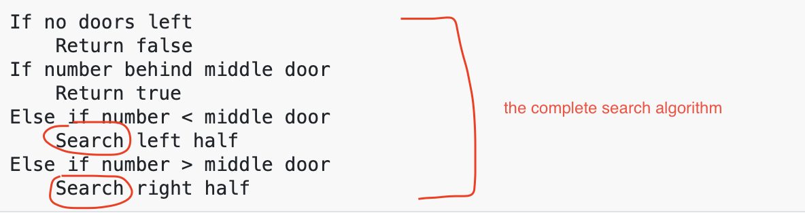
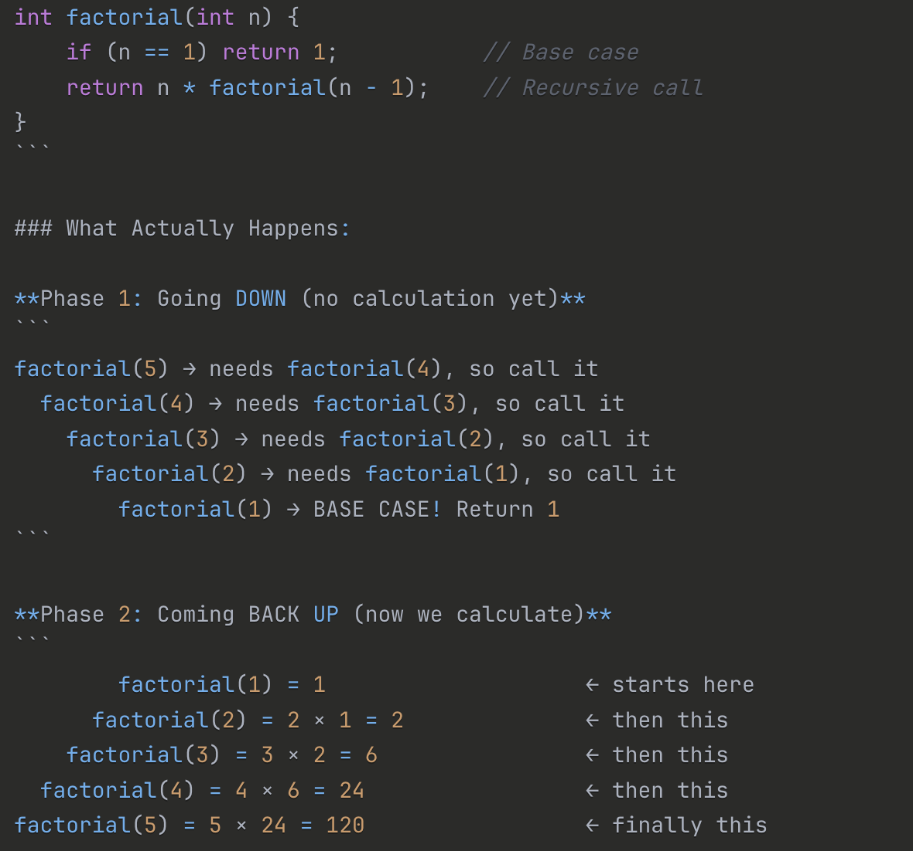
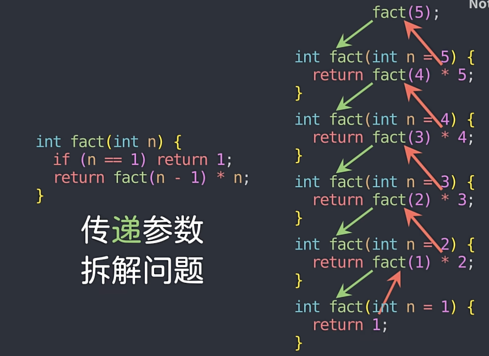
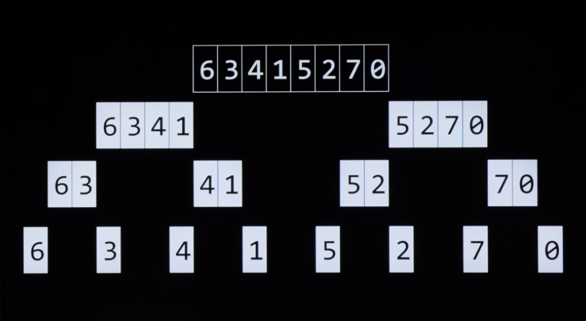

## Prologue  
 -The goal of finding person in a phone book(lecture 0), was to talk about just how good the algorithm was. It is not about the correctness of the algorithm, but about the design and if you can make a better algorithm using your intuitions and hard works to speed up things processed.  
 
 -The computers can only look at one location in memory at a time, it has to go step by step to search for the information, which means it has to go check the index and data everytime to find the wanted value.  

 
## Searching   
 -Using the array as an example, think the array metaphorically like a series of seven lockers.  
 
   
  
 -We can imagine that we have an essential problem of wanting to know 'is the number 50 inside an array?'. A computer must look at each locker to be able to see if the number 50 is inside. We call this process of finding such a number, character, string, or other item searching. 
 -We can hand over this task to an algorithem, wherein our algorithm will search through our lockers to see if the number 50 is behind one of the doors, returning the value ```true``` or ```false```.   
  
   
 
 -As showen above, there will always going to be some kind of algorithm for solving this problem.  

###Linear Search  
 -Linear search is one of the simplest algorithm. It is literally walking in a line from left to right, keep looping until the wanted value is obtained. This works on unsorted data.  
 
  -A pseudocode example for linear search:
  
    For i from 0 to n-1
    	If 50 is behind doors[i]
        	Return true
	 Return false   
	 
 -Notice that the ```return``` function is written at the end of the loop, or otherwise the program is going to be stopped as the first locker does not contain 50.  
 

###Binary Search  
 -Binary search is an efficient algorithm what works by repeatedly dividing in half the portion of the list that could contain the item, until you've narrowed down the possible locations to just one. This only work if the data is sorted in order.  
 
  -A pseudocode example for linear search:
  
    If no doors left
    	Return false
	 If 50 is behind doors[middle]
    	Return true
	 Else if 50 < doors[middle]
    	Search doors[0] through doors[middle - 1]
	 Else if 50 > doors[middle]
    	Search doors[middle + 1] through doors[n - 1]
    	
   -The idea is to exclude the initial middle value and look at other half portions.  
   
  
##Running Time  
 -Running time refers to the amount of time it takes an algorithm to solve a problem. Running time involves an analysis using big O notation.   
 -The big O notation describes how the running time of an algorithm grows as the input size increases. Rather than being ultra-specific about the mathematical efficiency of an algorithm, it is focused on the order of various running times, so the precision becomes vague on intention.  
 -The big O notation vagues precision by ignoring the following aspects:  
 	1. Constant factors: O(5n) and O(n) are both just "O(n)".  
 	2. Lower-order terms: O(n² + 100n + 500) simplifies to "O(n²)".  
 	
 -In this way, two different O(n) algorithem might be 100x faster than another O(n) algorithm as it can be ```10n``` and ```n```.  
 -In short words, by using the big O notation, we are describing the *general shape* of growth but not precise measurements.  
 -So when someone says "this algorithm is O(n log n)," they're saying "it scales roughly like n times log n, give or take some details I'm not worrying about."  
 
     
   
 -In the above graph, the first algorithm is 𝑂⁡(𝑛) or in the order of n. The second is in 𝑂⁡(𝑛) as well. The third is in 𝑂⁡(log⁡𝑛). 
 
###Upper and Lower Bound  
 -We are interested in both the worst-case, or *upper bound*, and the best-case, or *lower bound*. The bound describes how many time or step or time does the algorithm need to take to obtain the wanted output.  
 -The Ω symbol is used to denote the best-case of an algorithm, such as Ω⁡(log⁡𝑛).  
 ***Big O by default describes the worst-case upper bound.***   
 -The Θ symbol is used to denote where the upper bound and lower bound are the same: Where the best-case and the worst-case running times are the same.  
 
 -Asymptotic notation is the measure of how well algorithms perform as the input gets larger and larger. It is the notation you use talking about running time over time when consider an algorithm.  
 
 -When creating an array, we can leave the square bracket empty and create a curly braces to put in the data we want in an array. The array will then automatically count how many componets are in the variable. This is useful when we want to create an array with specific values.  
 
### Linear Search example and main() function  

	// Implements linear search for integers

	#include <cs50.h>
	#include <stdio.h>

	int main(void)
	{
    	// An array of integers
    	int numbers[] = {20, 500, 10, 5, 100, 1, 50};

    	// Search for number
    	int n = get_int("Number: ");
    	for (int i = 0; i < 7; i++)
    	{
        	if (numbers[i] == n)
        	{
            	printf("Found\n");
            	return 0;
        	}
    	}
    	printf("Not found\n");
    	return 1;
	}
	
 -It is important to keep in mind that the ```main()``` function can also return an value, we can use this to return a value anywhere inside the ```main()``` function to indicate when to exit the program and if the program exit with or without an error.  
 
 -If we don't initialise the array, the garbage value will be used as it was the previous value in that array.  
 
 -To use a comparing operator such as ```==``` they only works fine for integers, longs and chars, but doesn't work for strings.  
 
 -So when comparing the two strings, we have to use a funciton from the header file ```string.h``` called ```str compare```, or ```strcmp``` for short.  
 	-**String compare:** This function compares the two strings ```s1``` and ```s2``` and is case sensitive. Although it compares two value, it can return three different outcomes:
 	1. an int less than 0 if s1 comes before s2,  
  	2. 0 if s1 is the same as s2,  
	3. an int greater than 0 if s1 comes after s2.  
	-This suggests this function also compare two strings alphabetically, based on the characters' ASCII values.(This is case sensitive as well).  
	
## Data Structures  
 -It turns out that C allows us to create our own data types via a ```struct``` function.  
 
 -example of a structure:  
 	 
    typedef struct
	 {
    	 string name;
    	 string number;
	 } person;  //person and curly brace on the same line is prefered
	 
 -What is happening here is define a type that is itself a structure inside of which is both a ```name``` and a ```number```, which are both strings in this case, and call that whole new structure ```person```. As soon as it gets to end (semi-colon), a ```person``` data type does now exist.  
 
 -It is important that when dealing with numbers that might potentially containing other punctuations, such as hyphen or parenthesis, or not going to perform math on that number, we should instead store it as a string.  
 
 -Now we can create a phonebook program where the person's name and their phone number are connected and the order them inside array are not sensitive anymore.  
 
###phonebook.c  
 -To define the values of the string ```name``` and the string ```number```, we create an array called ```people``` that is the type ```person``` we just created. Then, we update the names and phone numbers of the two people into the ```people``` array with a wanted index. Most importantly, the *dot operator*.  
 -Once we have created a structure inside of the computer's memory, if we want to go inside it and access the things that compose it, we use a *dot operator*.  
 -The dot operator allows us to access the data type at a specific location and assign that individual a name.
 

	//follow from the previous typedef struct function  
	
    person people[3]; //size of 3

    people[0].name = "Yuliia";
    people[0].number = "+1-617-495-1000";  
    
 -E.g  
 In here, the component we created are ```name``` and ```number```, we use the dot operator ```people[0].name```, to go inside the first person and access their ```name```, and set it equal to the name "David". The same thing has been done to the ```number``` as well. 
 
 
 allows us to access the data structure ```person``` at 0th location and assign that individual a name. (people[] is an array that is type of person).  
 
 -What is new is that we have invented a new data type called ```person``` that we can now use in our code, and we are accessing the individual fields or attributes of that new structrue by using this new *dot operator* to go inside of that custom structure.  
 
## Sorting 
-*Sorting* is the act of taking an unsorted list of values and transforming this list into a sorted one. When a list is sorted, searching that list is far less taxing on the computer. Recall that we can use binary search on a sorted list but not on an unsorted one.  

###Selections sort  
 -select the smallest element and select the next smallest element.  
 
    index = 1
    for the number index i = 0, if i is smaller than n-1, the number increase index by one
    if arry[i] > arry[index], array[i] = array[index]
    
   
### ***Sorting and memories***
 -It might seem inefficient as we are surprised to discover new numbers in an array, even though on my first iteration I have looked at all of the numbers in the array.  
 
 -But we have to consider about what memory we are using now, we could have memorized all of the numbers and where they are, but we could also using a single variable in the brain just to keep track of the then smallest element. After solving this problem, we move on to do it again and again. But this is where things become different; we could use more memory and I could have been smarter about it and maybe that would have improved or hurt the running time of the algorithm. So it is important to keep in mind that ***there's often going to be a trade-off between how much memory or how much time you actually use.***   
 
 -Now we go back to the algorithm for the selection sort.  
 -Summarizing those steps, the first time iterating through the list took ```n - 1``` steps. The second time, it took ```n - 2``` steps. Carrying this logic forward, the steps required could be represented as follows:  
 	  
    (n - 1) + (n - 2) + (n - 3) + ... + 1  
    
 -Notice that the sum of the sequence is arithmetic, so this is equal to 
 
    n^2/2 - n/2 #which is O(n^2) for selection sort  
    
 -The best case for selection sort is ``O(n^2)`` as well, this is the silly part for the selection sort, as even if the numbers in the array is sorted already, the algorithm still have taken the same number of steps as it keeps on checking blindly.  
 

## Bubble sort  
 -Bubble sort is another sorting algorithm that works by repeatedly swapping elements to 'bubble' larger elements to the end.  
 
    Repeat n-1 times //n-1 steps
        For i from 0 to n–2 //n-1 steps
        	If numbers[i] and numbers[i+1] out of order
            	Swap them //constant but nothing to do with the length of the array
    	  If no swaps
        	  Quit  
 
 -The upper-bound is ``(n-1) x (n-1)`` which is ``O(n^2)`` as well as we only take care of the highest order of the term. However, by adding a quitting condition, the lower-bound is in the order of ``Ω⁡(𝑛)``.  
 
## Recursion  
-Recursion is a concept within programming where a function calls itself. For example, in the binary search pseudocode, the search algorithm is using a search algorithm.  

-***In here, recursion can improve efficiency by breaking down a problem into smaller subproblems, where each recursive call works on a reduced portion of the data, excluding parts that have already been processed or determined to be irrelevant.***

  

-Implicityly to search the left half and search the right half means shorten the list by half, and in this algorithm we do this again and again, which is applying the same logic to a smaller data set. By doing this we are shrinking the problem, the problem is getting smaller, so eventually we will get to a positive or negative result.  

-A base case is the stopping condition for recursion. Without it the function would call itself forever. The base cases are when to stop recursing, each call of the function must move closer to the base case.  

-A recursive algorithm or a recursive function is one that calls itself, that uses itself, but hopefully on a smaller and smaller size problem.  

-What do we mean when we search the left and the right half? The truth is that doesn't matter, we don't need to know how to search half of a book, we already know how to search a whole book. So just use the same logic to search half as many pages.  

## Recursive and Iterative  
 -***Iteration moves forward step-by-step. Recursion breaks down, solves smallest piece, then builds back up.***  
 
 -For iterative, it uses loops to repeat code until a condition is met (so constant). The state is tracked with variables that update each iteration. It is more memory efficient as it only stores loop variables and no function call overhead.  
 -For recursive, the function calls itself with progressively smaller/simpler inputs. There must have a base case (stopping condition) or runs forever. ***Recursion works backwards:*** it go all the way to the base case first, then calculate on the way back. Each funciton call stays in memory until it returns, so it is slower.  
 -Sometimes, one problem is just better suited for one or the other. 
 
   
 
### Pyramid structure  
 -The  physical structure of a pyramid of height 4 can be see as recursive. The pyramid of height 4 is a pyramid of height 3 plus 1 more layer of bricks, a pyramid of height 3 is a pyramid of height 2 with one more layer of bricks... and a pyramid of height 1 is just a single brick, which is the last statement and can be seen as a base case.  
 -Up to some point (base case), we have to stop and say pyramid of height 1 is just a single brick. But everything else can be recursively defined in terms of a pyramid of a smaller size.  
 
## Flowcharts(?) of the recursion  

  

  


## Merge Sort  




## Ways of sorting  
 -Selection sort iterates through the unsorted portions of a list, selecting the smallest element each time and moving it to its correct location.  
 -Bubble sort compares pairs of adjacent values one at a time and swaps them if they are in the incorrect order. This continues until the list is sorted.  
 -Merge sort recursively divides the list into two repeatedly and then merges the smaller lists back into a larger one in the correct order.
 
 
